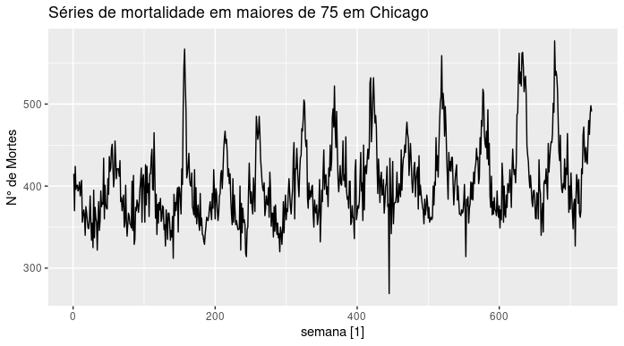

RPLOT.1.png

# Análise de Séries Temporais - Atividade prática da 1° prova

## 📌 Descrição
O objetivo deste estudo é modelar uma série temporal de mortalidade de pessoas com mais de 75 anos na cidade de Chicago, EUA, utilizando dados semanais. A série abrange 731 observações, que representam o total de mortes em cada semana, desde 1987 até 2000. A visualização dessa série pode ser observada na Figura 1:

## 🔍 Metodologia
1. **Exploração inicial**: Visualizações e estatísticas descritivas.

A Figura 1 revela uma leve tendência ao longo dos anos e uma notável sazonalidade anual. Observa-se um padrão de diminuição das mortes na metade do ano e um aumento no final e início do ano.

A Figura 2 detalha o efeito da sazonalidade na série de mortalidade, com um padrão repetitivo anualmente, incluindo alguns picos mais acentuados.
  
  
