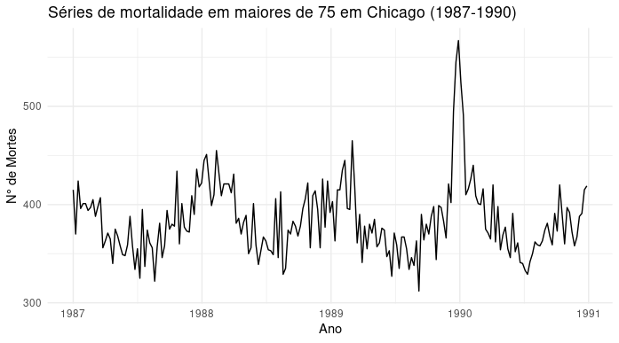
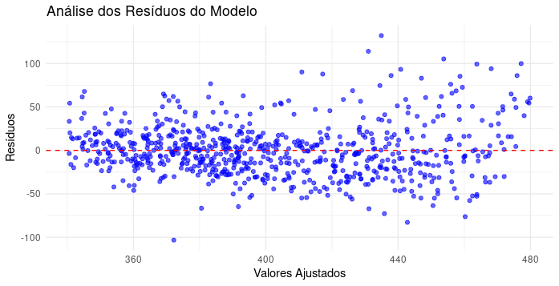
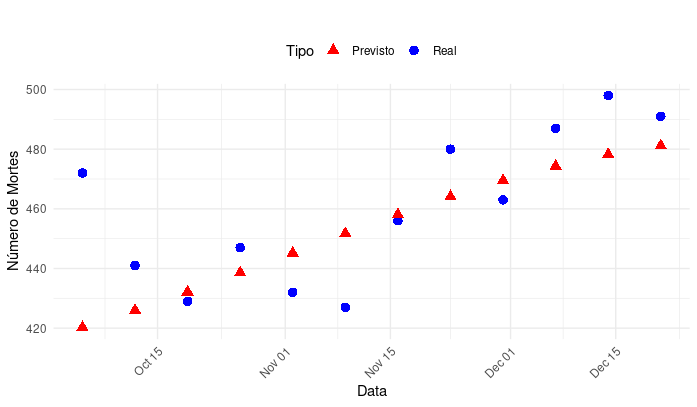

# Análise de Séries Temporais - Atividade prática da 1° prova

## 📌 Descrição
O objetivo deste estudo é modelar uma série temporal de mortalidade de pessoas com mais de 75 anos na cidade de Chicago, EUA, utilizando dados semanais. A série abrange 731 observações, que representam o total de mortes em cada semana, desde 1987 até 2000. A visualização dessa série pode ser observada na Figura 1:

## 🔍 Metodologia
1. **Exploração inicial**: Visualizações

*Figura 1: Série temporal de mortalidade semanal de pessoas com mais de 75 anos
em Chicago (1987-2000).*


*Fonte: Autor*

A Figura 1 revela uma leve tendência ao longo dos anos e uma notável sazonalidade anual. Observa-se um padrão de diminuição das mortes na metade do ano e um aumento no final e início do ano.

A Figura 2 detalha o efeito da sazonalidade na série de mortalidade, com um padrão repetitivo anualmente, incluindo alguns picos mais acentuados.
  
*Figura 2: Série temporal de mortalidade semanal para o período de 1987 a 1990,
destacando a sazonalidade.*

 *Fonte: Autor*

Dado que a série temporal apresenta um ciclo anual, o modelo de regressão
harmônica foi escolhido.

## 📊 Resultados da Modelagem

```r
Coefficients:
             Estimate Std. Error t value Pr(>|t|)    
(Intercept) 3.752e+02  2.273e+00 165.092  < 2e-16 ***
semana      7.564e-02  5.478e-03  13.808  < 2e-16 ***
COS1        3.934e+01  1.609e+00  24.448  < 2e-16 ***
SIN1        2.203e+01  1.601e+00  13.759  < 2e-16 ***
COS2        4.642e+00  1.602e+00   2.897  0.00388 ** 
SIN2        6.709e+00  1.606e+00   4.177 3.31e-05 ***
---
Signif. codes:  0 ‘***’ 0.001 ‘**’ 0.01 ‘*’ 0.05 ‘.’ 0.1 ‘ ’ 1

Residual standard error: 30.39 on 712 degrees of freedom
Multiple R-squared:  0.5788, Adjusted R-squared:  0.5759 
F-statistic: 195.7 on 5 and 712 DF,  p-value: < 2.2e-16
```


• Intercepto: O coeficiente é 375,3 com uma estatística t de 2,241 e um p-valor inferior a 2 × 10−16, indicando que é estatisticamente significativo e sugere um valor base considerável para a variável dependente.

• Variável t: O coeficiente é 0,075 com uma estatística t de 0,005 e um p-valor inferior a 2 × 10−16. Isso indica uma tendência linear significativa ao longo do tempo.

• Componentes Sazonais: COS1 (39.34) e SIN1 (22.03) → Representam a primeira harmônica da sazonalidade. COS2 (4.64) e SIN2 (6.71) → Representam a segunda harmônica. Todos os termos sazonais são significativos, confirmando que há padrões periódicos relevantes na série temporal.

A análise dos resíduos do modelo, mostrada na Figura 3, indica não haver padrão nos resíduos, sugerindo serem independentes.
*Figura 3: Resíduos do Modelo de Regressão Harmônica.*

 *Fonte: Autor*

# Análise de Previsões vs. Valores Reais

Na Figura 4 pode-se observar os valores observados contra preditos, alguns valores ficaram bem próximos dos valores reais, porém alguns ficaram longes distantes.

*Figura 4: Comparação entre Valores Reais e Previstos.* 

 *Fonte: Autor*

## 📊 Tabela de Comparação

| Data       | Real | Previsto | Erro Absoluto |
|------------|------|----------|--------------|
| 2000-10-05 | 472  | 420      | 51,79        |
| 2000-10-12 | 441  | 426      | 15,03        |
| 2000-10-19 | 429  | 432      | 3,13         |
| 2000-10-26 | 447  | 438      | 8,44         |
| 2000-11-02 | 432  | 445      | 13,13        |
| 2000-11-09 | 427  | 452      | 24,69        |
| 2000-11-16 | 456  | 458      | 2,05         |
| 2000-11-23 | 480  | 464      | 15,96        |
| 2000-11-30 | 463  | 469      | 6,50         |
| 2000-12-07 | 487  | 474      | 12,74        |
| 2000-12-14 | 498  | 478      | 19,82        |
| 2000-12-21 | 491  | 481      | 9,87         |

📈 **Métricas de erro:**  
- **Erro Absoluto Médio (MAE):** 14,97  
- **Erro Quadrático Médio (MSE):** 15,33.

---
📌  Conclusão
✔️ O modelo capta bem a tendência e a sazonalidade da série.
✔️ Os coeficientes são altamente significativos.
⚠️ O R² sugere que há componentes não explicados → testar outras abordagens, como modelos ARIMA ou adição de variáveis externas.
